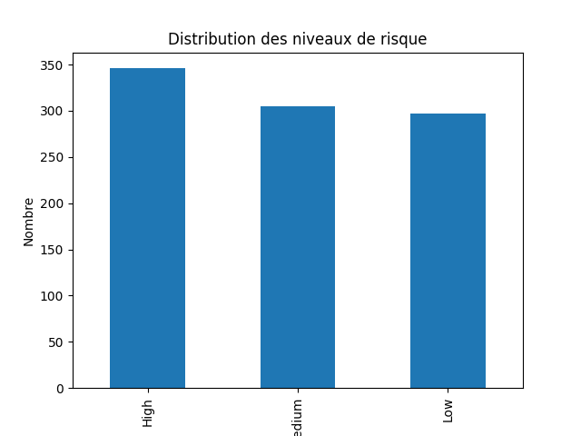
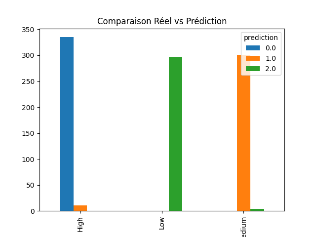
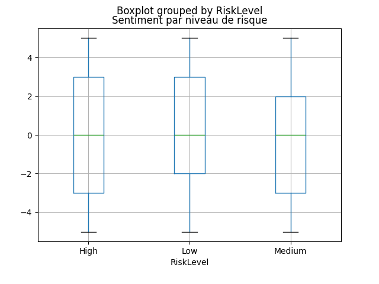
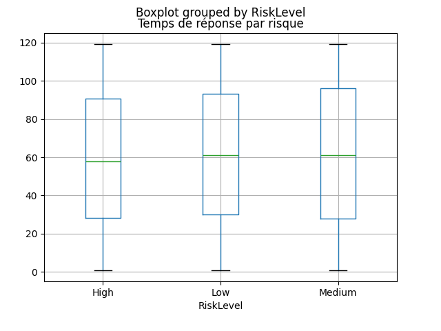

# Churn Prediction avec PySpark

## 📌 Description
Ce projet implémente un pipeline Big Data pour analyser le comportement des clients et prédire le churn.

## ⚙️ Technologies utilisées
- PySpark
- Hadoop (HDFS)
- Python
- Machine Learning (Random Forest)

## 📊 Étapes du projet
1. Chargement des données depuis HDFS
2. Analyse exploratoire (EDA)
3. Jointure des datasets
4. Feature Engineering
5. Modélisation avec Random Forest
6. Visualisation des résultats

## 📈 Résultats
- Identification des clients à risque
- Analyse du sentiment client
- Modèle de prédiction du churn

## 📷 Visualisations

  
  
  
  

## 🚀 Exécution

```bash
python pipeline.py
